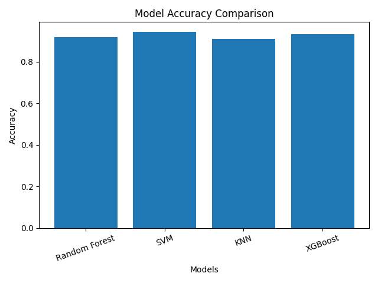
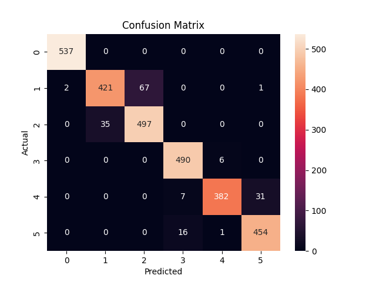
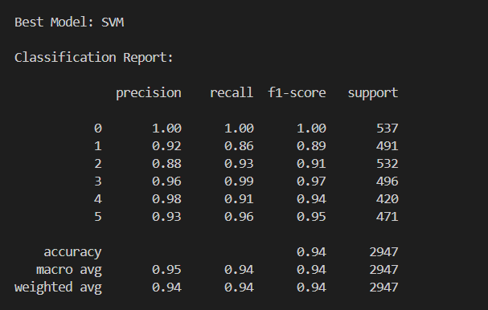
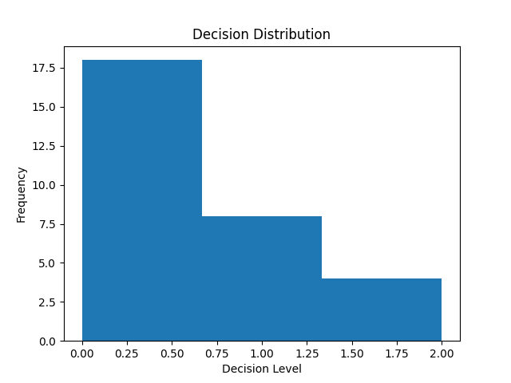

# 🚀 Signal-Aware Human Activity Recognition with Risk Intelligence

## 📌 Overview

This project presents an **intelligent Human Activity Recognition (HAR) system** that combines **Machine Learning, Signal Processing, and Decision Intelligence** to classify human activities and assess behavioral risk levels.

Unlike traditional HAR systems, this project introduces a **secondary decision layer** that evaluates extracted signal features and predicts **risk categories** using clustering and classification techniques.

---

## 🧠 Key Features

* ✅ Multi-model ML pipeline (Random Forest, SVM, KNN, XGBoost)
* ✅ Feature selection using importance ranking
* ✅ Signal processing (time-domain, change detection, FFT)
* ✅ Custom feature extraction (statistical + frequency features)
* ✅ Decision Intelligence layer (risk classification)
* ✅ Real-time simulation system
* ✅ Evaluation metrics and visualization

---

## ⚙️ Tech Stack

* Python
* NumPy, Pandas
* Scikit-learn
* XGBoost
* Matplotlib, Seaborn

---

## 📊 Model Evaluation

### 🔹 Model Accuracy Comparison



### 🔹 Confusion Matrix



### 🔹 Classification Report Visualization



### 🔹 Decision Distribution



---

## 📈 Evaluation Metrics

The system is evaluated using:

* **Accuracy Comparison** → Compare multiple ML models
* **Confusion Matrix** → Class-wise prediction performance
* **Classification Report** → Precision, Recall, F1-score
* **Decision Distribution** → Behavior of risk prediction system

---

## 🧪 Methodology

1. **Data Loading & Preprocessing**

   * Dataset loaded from CSV files
   * Labels encoded into numeric format

2. **Feature Selection**

   * Top 200 features selected using Random Forest importance

3. **Model Training**

   * Multiple models trained and evaluated
   * Best model selected automatically

4. **Signal Analysis**

   * Time-domain signal visualization
   * Signal change detection
   * Frequency analysis using FFT

5. **Decision Intelligence Layer**

   * Feature extraction from signals
   * Activity prediction
   * Clustering (KMeans) for risk labeling
   * Decision model training

6. **Simulation**

   * Random samples processed
   * Activity + risk prediction displayed

---

## 🧠 Decision Intelligence (Core Idea)

The system introduces a **second-level AI model** that:

* Extracts signal-based features
* Combines them with predicted activity
* Uses clustering to define risk categories:

  * ✅ Safe
  * ⚠️ Moderate Risk
  * 🚨 Critical Alert

> ⚠️ Note: Risk labels are **pattern-based (unsupervised)** and not medical diagnoses.

---

## 📂 Project Structure

```
HAR-Activity-Recognition/
│
├── src/
│   ├── data_loader.py
│   ├── preprocessing.py
│   ├── models.py
│   ├── feature_selection.py
│   ├── decision_system.py
│   └── evaluation.py
│
├── assets/              # graphs and visualizations
├── data/ (ignored)
│
├── main.py
├── requirements.txt
└── README.md
```

---

## ▶️ How to Run

```bash
pip install -r requirements.txt
python main.py
```

---

## 📦 Dataset

Dataset used:
👉 UCI Human Activity Recognition Dataset

Download from:
https://www.kaggle.com/datasets/uciml/human-activity-recognition-with-smartphones

Place files in:

```
data/Dataset/
├── train.csv
├── test.csv
```

---

## 💼 Resume Description

> Developed a signal-aware human activity recognition system using machine learning and signal processing techniques, enhanced with a decision intelligence layer to classify behavioral risk patterns.

---

## 🎯 Future Improvements

* Real-time sensor integration (IoT / wearable devices)
* Deep learning models (CNN, LSTM)
* Web dashboard (Streamlit / Flask)
* Deployment

---

## ⭐ Key Highlights

* 🔥 Multi-layer intelligent system
* 🔥 Combines ML + Signal Processing + Decision AI
* 🔥 Fully modular and scalable architecture
* 🔥 Strong evaluation and visualization

---

## 👤 Author

**Aanya Chandrakar**

---

## 🌟 If you like this project

Give it a ⭐ on GitHub!
